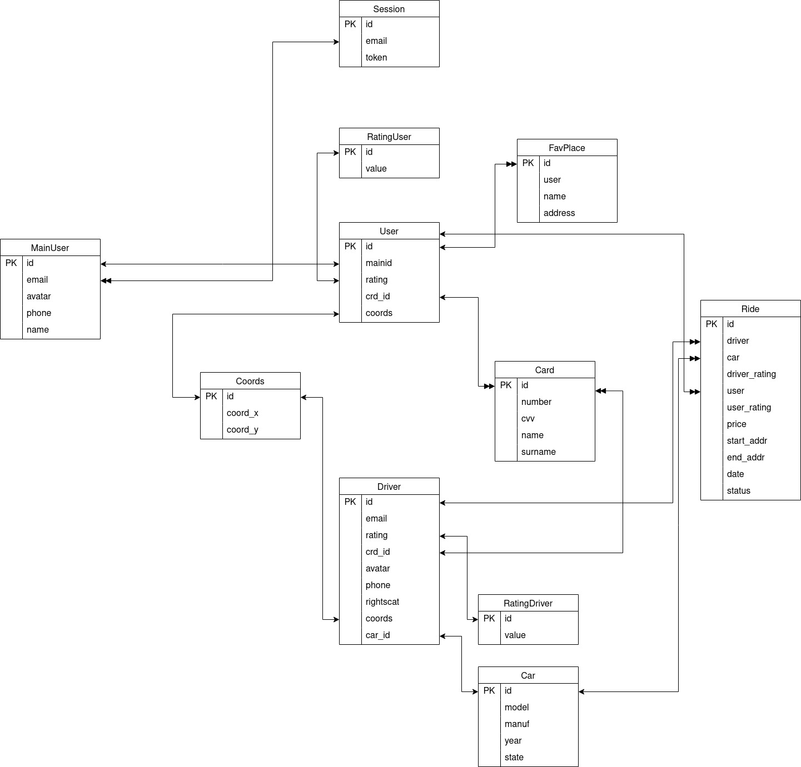

# Яндекс.Такси

## Содержание
- [1. Тема и целевая аудитория](#11-тема)
    - [1.1 Тема](#11-тема)
    - [1.2 Целевая аудитория](#12-целевая-аудитория)
- [2. Расчет нагрузки](#2-расчет-нагрузки)
    - [2.1 Расчёт запросов](#21-расчёт-количества-запросов)
    - [2.2 Расчёт БД](#22-расчёт-бд)
- [3. Логическая схема](#3-логическая-схема-бд)
- [4. Физическая схема](#4-физическая-схема-бд)
- [5. Технологии](#5-технологии)
- [6. Схема проекта](#6-схема-пректа)
- [Список литературы](#список-литературы)

## 1.1 Тема

**Яндекс.Такси** - одна из самостоятельных бизнес-единиц «Яндекса», предлагающая сервисы такси.

### MVP:

1. Профиль таксиста и пользователя.
2. Заказ такси на адрес.
3. Отображение списка заказов таксистам.
4. Чат с водителем.
5. Отображение местоположения таксистов.
6. Построение маршрута и расчёт стоимости по этому маршруту.

## 1.2 Целевая аудитория

Клиентами компаний становятся потребители в возрасте от 18 до 65 лет с разным уровнем достатка. Наиболее частыми клиентами такси являются люди в возрастной категории от 25
до 45 лет.

Наиболее часто пользуются услугами такси следующие категории граждан:
- люди, которые не располагают собственным транспортом;
- люди, которые имеют в собственности личный автомобиль, но не имеют возможности использовать его;
- люди, опаздывающие куда-либо и не рискующие воспользоваться общественным транспортом;
- люди с маленькими детьми; с тяжелыми сумками или другим крупногабаритным грузом или багажом;
-  клиенты, нуждающиеся в транспорте в ночное время суток; клиенты, находящиеся в состоянии алкогольного опьянения.[^1]

Работает в 17 странах [^2]

Доли[^3]:

| Страна        | Доля запросов       |
|---------------|---------------------|
|Россия         |88.47%|
|Беларусь       |4.78%|
|Киргизстан     |3.14%|
|Казахстан      |1.18%|
|Узбекистан     |0.21%|
|Остальное      |2.22%|

### Посетители

| Месяц | Посетителей в месяц |
| ------------- | ------------|
| Ноябрь 2022г  | 4.0 млн     |
| Декабрь 2022г | 4.1 млн     |
| Январь 2023г  | 3.8 млн     |
| Февраль 2023г | 3.7 млн     |

Подтверждение данных через SimilarWeb за ноябрь и декабрь 2022г и январь 2023[^3]

По данным 2020г. в Яндекс.Такси работает 700000 водителей (также пользователей сервиса)[^4]

Яндекс.Такси обрабатывает около 70% заказов такси в России[^5], при этом по Росcии в 2021г было произведенео 2620 млн поездок[^6].
Таким образов на базе Яндекс.Такси в России произволится 2620*0.7/365 ~ 5 млн поездок в день.

## **2. Расчет нагрузки**

Количество поездок в день: ~5 млн

Пользователей в месяц: ~4 млн

Исходя из этого грубо примем, что большинство из них - постоянные клиенты и заказывают такси каждый день, то есть по 5 млн. поездок / 4 млн пользователей = 1.25 раз в день.

По данным сайта SimilarWeb пользователь проводит на сайте до 3-х минут, что примерно совпадает со средним временем ожидания такси по личному опыту.

Каждому пользователю, который зашел в приложение, показывается карта с расположением автомобилей, эта информация обновляется примерно раз в 5 секунд исходя из собственных замеров.

Пользователь может заходить проверять сервис, чтобы сравнить цены на поездку, но не вызывая такси, учитывая это, примем значение открытия приложения без заказа такси в день примем равным 1.

Из данных выше выходит, что пользователь получает информацию о свободных машинах (1.25 заказов в день + 1 заход без заказа в день) * 3 минуты в сервисе за раз * (60 секунд в минуте / 5 секунд кулдаун на получение новой информации) = 81 раз в день.

Пользователь использует подсчёт цены 1.25 раз в день при заказе + 1 раз в день без заказа = 2.25 раз в день.

При слежке за водителями отображается карта, которая скорее всего получается от сервиса карт Яндекса. Для отображения одной локации в яндекс картах используется около 6 тайлов (Проверено самостоятельно опытным путём) и нахождение пользователя на одном месте при просмотре карты как правило не потребуется больше 16 (Т.к. скорее всего не отобразится больше чем по 3 тайла сверху и снизу и ещё 4 с одной из боковых сторон) тайлов - 2.25 * 16 = 36 раз.

|Заказ такси|Отслеживание ближайших машин|Подсчет цены, примерного времени поездки для заданного маршрута|Получение тайлов для карт|
|--|--|--|--|
|1.25|81|2.25|36|

### 2.1 Расчёт количества запросов

#### Расчет количества запросов в день:
- заказ такси - 5 млн
- местоположение автомобилей - 81 запрос в день * 4 млн пользователей = 324 млн
- подсчет цены, примерного времени поездки для заданного маршрута - 2.25 * 4 млн = 9 млн
- получение тайлов для карт = 36 * 4 млн = 144 млн

Заказ такси требует передачи не требует существенных данных

Запрос местоположения автомобилей не требует существенных данных

Запрос подсчета цены и примерного времени поездки для заданного маршрута  не требует существенных данных

Подтверждение заказа требует следующих существенных данных:

Размер аватара водителя примем в среднем равным 1Мб.

1Мб на аватар * 5 млн заказов в день = 4.77 Тб в день

Запрос тайлов для карт и отображения местностипри трекинге водителей требует следующих существенных данных:

Размер одного тайла ~20Кб(проверено на Яндекс. Картах)
Итог: 20Кб на тайл * 36 запросов тайлов в день у пользователя * 4 млн пользователей = 2880 млн Кб ~ 2.68 Тб в день

#### Суммарный суточный трафик (Тб/сутки):

4.77 + 2.68 = 7.45 Тб в сутки

#### Пиковое потребление в течении суток (Гб/c):

Пиковое время для сервиса такси - вечера пятницы и субботы с 18:00 до 23:00 - в этот период совершается в 2 раза больше заказов, чем в рабочие часы по будням[^7]

7.45 Тб в обычный день / 24 часа в сутках / 60 минут в часе / 60 секунд в минуте * 2 раза больше нагрузка = 0,17 ГБ/с

### 2.2 Расчёт БД

Всего пользователей скачало приложение - 100 млн[^8], однако это сервис Яндекса и большая часть информации хранится в отдельной базе Яндекса, а не базе сервиса, поэтому рассмотрим данные нужные конкретно сервису такси. Приложение содержит не только услуги такси, но так как они объединены в одно приложение предположим, что имеют общую базу и попробуем расчитать часть, которую на себя берёт Яндекс.Такси.
Для каждого пользователя требуется хранить следующие свойства:
- email (строка, 100 байт) - для связи с основным аккаунтом;
- рейтинг пользователя (число с плавающей точкой, 4 байта);
- координаты: (2 числа с плавающей точкой по 8 байт, 16 байт)
- избранные места (список из мест, каждое место хранится в виде: д- координаты: (2 числа с плавающей точкой по 8 байт, 16 байт), название (строка, 100 байт));
- история заказов (Т.к. дублируется и у водителя, хранится как отдельные данные)(список заказов, каждый заказ состоит из id пассажира (целое число, 4 байта), id водителя (целое число, 4 байта), id автомобиля (целое число, 4 байта), продолжительность поездки (целое число, 4 байта), цена поездки (целое число (4 байта), оценка водителя (целое число, 1 байт), оценка клиента (целое число, 1 байт), маршрут поездки (чтобы описать маршрут, необходимо знать точки начала и конца маршрута, все ветвления дорог, через которые проложен маршрут. Среднаяя продолжительность поездки - 15 км[^7] - пусть ветвление встречается 1 раз на 50 метров. Одна точка на карте состоит из 2 чисел в плавающей точкой, тогда для описания всего маршрута в среднем уходит (300 + 2) * 4 * 2 = 2 416 байт;)))
- данные платежной карты (номер карты - 8 байт, cvv-код - 1 байт, дата выдачи карты - 4 байта, имя  - 50 байт, фамилия - 50 байт);

Всего водителей в сервисе - 700 000 человек.

Для водителя требуется хранить следующие данные:
- фото (изображение, 3 Мб);
- имя (строка, 100 байт);
- email (строка, 100 байт);
- номер телефона (строка, 40 байт);
- рейтинг водителя (число с плавающей точкой, 4 байта);
- категория прав (символ, 2 байта, т.к. хранится будет как строка и имеется закрывающий байт)
- координаты: (2 числа с плавающей точкой по 8 байт, 16 байт)
- Информация о машине (1. Название модели (строка, 100 байт), название производителя (строка, 100 байт), год выпуска (целочисленное поле, 2 байта), состояние (символ, 2 байта))
- история заказов (аналагочно клиентской, хранится отдельно)
- данные платежной карты (номер карты - 8 байт, cvv-код - 1 байт, дата выдачи карты - 4 байта, имя  - 50 байт, фамилия - 50 байт);

#### **Бинарные данные:**
Из бинарных данных хранятся только фотографии водителей:
3 * 500 000 = 1,43 Тб

#### **Рассчет количества даных по типам:**
Пусть каждого пользователя примерно 2 избранных места.
Сейчас каждый день совершается 5 млн. поездок в день, но раньше это число было значительно меньше, в 2018 году Яндекс.Такси набрало миллиард поездок за 7 лет работы сервиса[^10], поэтому возмём что сейчас хранится (т.к. крайне старые хранить смысла нет) поездок в общей сложности около 2.5 млрд.

#### **Целые числа:**
Крайне маленькое кол-во данных по сравнению с остальными, но учтём и их
4 * 100 000 000 + 15 * 500 000 + 18 * 2 500 000 000 = 2.7Гб

#### **Данные с плавающей точкой:**
32 байт * 100 000 000 + 2 416 байт * 2 500 000 000 = 5.628 Тб

#### **Cтроки:**

На одного пользователя приходится 400 байт строковых данных, для водителей 440 байт
400 байт * 100 000 000 + 440 * 700 000 = 37,46 Гб

#### **Размер хранения в разбивке по типам данных:**

|Бинарные|С плавающей точкой|Целые|Строки|
|--|--|--|--|
|50Тб|1.2ТБ|2.7Гб|37,46 Гб|

##  3. Логическая схема БД
### Основная БД
#### Пользователи:
|us_id|us_mainid|us_rating|crd_id|us_coord|
|-----|---------|---------|------|--------|
|pk   |fk       |         |fk    |        |

#### Водители:
|dr_id|dr_email|dr_rating|crd_id|dr_avatar|dr_phone|dr_rightscat|dr_coord|cr_id|
|-----|--------|---------|------|---------|--------|------------|--------|-----|
|pk   |      |         |fk    | | | | |fk|

#### Карты:
|crd_id|crd_number|crd_cvv|crd_name|crd_surname|
|------|----------|-------|--------|-----------|
|pk    |

#### Машины:
|cr_id|cr_model|cr_manuf|cr_year|cr_state|
|-----|--------|--------|-------|--------|
|pk   |

#### Поездки:
|rd_id|dr_id|us_id|cr_id|rd_usrating|rd_drrating|rd_price|rd_path|rd_date|
|-----|-----|-----|-----|-----------|-----------|--------|-------|--|
|pk   |fk   |fk   |fk   |

### Таблицы из БД других сервисов

#### Пользователи:
|us_id|us_email|us_avatar|us_phone|us_name|
|-----|--------|---------|--------|-------|
|pk   |

### Схема

## 4. Физическая схема БД
Редко обновляемые таблицы: машины, карты

Часто обновляемые: пользователи, водители, поездки

Редко обновляемые будут хранится в PostgreSQL

Часто обновляемые в Tarantool

Индексы:
rides - индекс по rd_date;
drivers - индекс по dr_id;
users - индекс по us_id;
cards - индекс по crd_id;
cars - индекс по cr_id;

Шардирование: Сервис существует давно, за это время накопилось очень много данных о поездках, поэтому таблицу нужно шардировать.
Табдицу пользоваелей также шардируем.

## 5. Технологии

|Технология|Применение|Аргументация|
|--|--|--|
|С++|Back-end|Самый низкоуровневый и быстрый из ООП языков, а быстродействие в приоритете|
|Tarantool|in-memory-вычисления|используется в местах, которые сильно ограничены временем, идеально подходит засчет своей производительности|
|Nginx|балансировка нагрузки, кэширование|широко распространенный, производительный веб-сервер, имеющий функции балансировщика L7 и кеширования|
|Apache Kafka|брокер сообщений|отправка асинхронных сообщений между сервисами|
|Яндекс.Карты (или их подсистема)|обработка географических данных, хранение и раздача тайлов карт. Внешний API|Другой сервис компании, поэтому точно находится под контролем, взаимодействие можно тонко настроить|

## 6. Схема пректа

## Список литературы

[^1]: [Проект по сдаче автомобилей на базе Яндекс. Такси](https://damu.kz/poleznaya-informatsiya/biznes-plani/2020/1.%D0%91%D0%B8%D0%B7%D0%BD%D0%B5%D1%81%20%D0%BF%D0%BB%D0%B0%D0%BD%20_%D1%82%D0%B0%D0%BA%D1%81%D0%B8.pdf)
[^2]: [Отчёт Яндекса за 2019г](https://company-docs.s3.yandex.net/prospectus/annual_2019.pdf)
[^3]: [Страница с метриками Яндекс.Такси SimilarWeb](https://www.similarweb.com/website/taxi.yandex.ru/#traffic)
[^4]: [Статья автокредитования для водителей в Яндекс.Такси](https://www.vedomosti.ru/business/articles/2020/10/01/841894-yandekstaksi-zapustilo)
[^5]: [Сравнение конкурентов Яндекса на фоне побега одного из них из Росии](https://www.cnews.ru/news/top/2021-11-08_estonskij_konkurent_yandeks)
[^6]: [Численность поездок на такси в России 2021г](https://marketing.rbc.ru/articles/13500/)
[^7]: [Исследования Яндекса о такси в Москве](https://yandex.ru/company/researches/2015/moscow/taxi)
[^8]: [Приложения Яндекс.Go](https://play.google.com/store/apps/details?id=ru.yandex.taxi&hl=ru&gl=US#:~:text=5%2C91%C2%A0%D0%BC%D0%BB%D0%BD%20%D0%BE%D1%82%D0%B7%D1%8B%D0%B2%D0%BE%D0%B2-,100%C2%A0%D0%BC%D0%BB%D0%BD%2B,-%D0%9A%D0%BE%D0%BB%D0%B8%D1%87%D0%B5%D1%81%D1%82%D0%B2%D0%BE%20%D1%81%D0%BA%D0%B0%D1%87%D0%B8%D0%B2%D0%B0%D0%BD%D0%B8%D0%B9)
[^9]: [Первый миллиард Яндекс.Такси](https://taxi.yandex.ru/blog/billion-trips)
